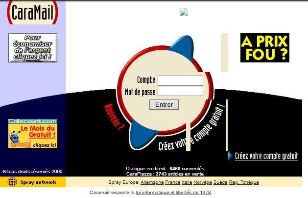
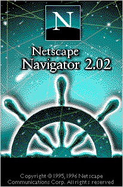
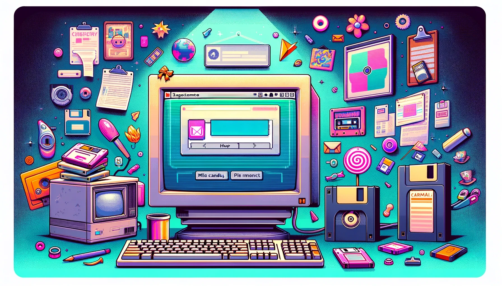
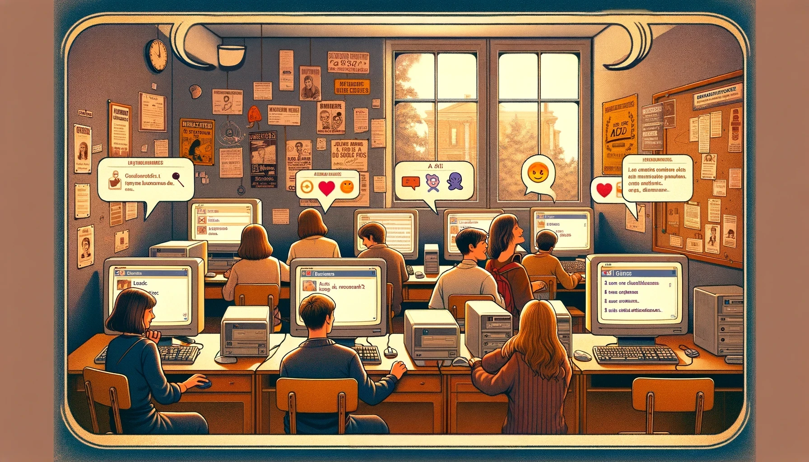
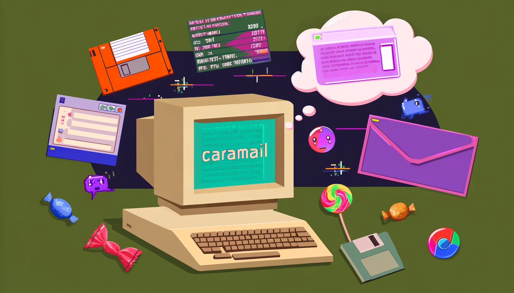

# Caramail, le mistral gagnant
par **Olivier Le Deuff**, professeur des universités. Bordeaux Montaigne.

---

## Une autre époque

- **Magie** de pénétrer un monde différent de la vie quotidienne
- Invention du terme **IRL** (*in real life*)
- Esthétique **chatoyante des années 90**
- **Netscape** et l'attente du **Nouveau Monde** du cyberespace

---

## Émergence de nouveaux acteurs

- **Web comme création européenne**  rapidement dominé par les Américains
- **Al Gore** et les autoroutes de l’information
- Services comme **Geocities**, **Yahoo**, et **Alta Vista**
- Équivalents français/francophones : **Myriade**, **Lokace**, **Multimania**, **Caramail**

---

## Évolution des services web

- Multiplication des services web et des sites persos. (esthétique kitsch, barres clignotantes, gif animé)
- Facilité de **visibilité** dans un espace informationnel réduit
- Partage et relais via **listes de diffusion**

---

## Caramail, le lieu prisé
- Créé en 1997 par **Orianne Garcia**, Alexandre Roos et Christophe Schaming (fondateurs de Lokace)
- Jeunes internautes, beaucoup d'étudiants sur le "chat".
- **Alias** et **services de messagerie**
- Combinaison de **mail** et **chat en ligne**
- Échange en temps réel sur divers sujets

---

## Sentiment et nostalgie

- **Excitation** de la nouveauté et **confort** d'usage en utilisant Caramail
- Utilisation excessive générant de la **culpabilité**
- **Nostalgie** après plus de 25 ans

---

## Souvenirs personnels d'université
- Accès aux salles informatiques de l’Université Rennes 2
- Usage du chat au lieu de travailler sérieusement
- **Rencontres et échanges culturels** via ASL (âge, sexe, localisation)

---

## Interface et fonctionnalités

- Interface ergonomique pour l’époque
- **Onglets** pour les dialogues collectifs et individuels
- Version allégée en **mode HTML** pour connexions lentes

---

## L’offre diversifiée de Caramail

- Services supplémentaires : **Carazine**, **Carafuté**, **Caramalette**, **Caraplazza**
- Fusion avec **Multimania** pour l’hébergement de sites web
- Portail, plateforme ou grande confusion ?

---

## Déclin de Caramail

- **Bulle internet** et investissements déraisonnés
- Acquisition par **Spray Network** en 2000 (environ 23 millions d'euros)
- Revente-absorption à **Lycos Europe**
- Dissolution progressive de Multimania et Caramail dans l'offre Lycos.

---

## Impact de la bulle internet

- Lycos et la difficulté de maintenir une **communauté**
- **Monétisation** par publicités intrusives
- Utilisateurs devenant plus **volatiles**

---

## Fin d’une ère

- Services de messagerie évoluant vers des logiciels d’IM
- **MSN Messenger** remplaçant Netmeeting
- Jubii et la tentative de réactivation de Caramail
- Gmx offre la possibilité d'avoir une adresse caramail.
---

## Héritage et nostalgie

- Rachat par **United Internet** en 2009
- Récupération de l’ancienne adresse Caramail
- **JuneLive.net** pour retrouver l’interface
- Importance de connaître l’histoire de Caramail

---

## Caramail, symbole du monde numérique d’avant

- Nostalgie et souvenirs d'une **hypermodernité** devenue désuète.
- Caramail comme un **bonbek fabuleux**
- Générations futures et la **nostalgie numérique**

