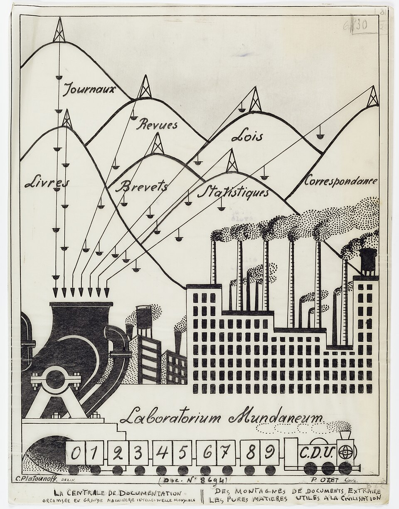
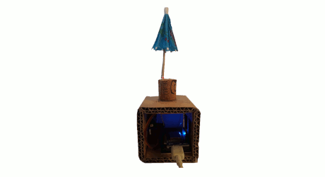

# Des données à l’objet  
### Les POCL entre culture technique et œuvre ouverte

**Olivier Le Deuff**  
*Laboratoire MICA, Université Bordeaux Montaigne* 
*Institut Universitaire de France*  

Colloque **CIDE 24**

---

# Contexte : les imaginaires industriels des données…

  

---
# Les imaginaires
- Schéma de Paul Otlet : la donnée comme **matière première** à transformer  
  - Big data, IA, automatisation à grande échelle  
  - Data centers, cloud, promesse d’optimisation continue  
- Question implicite : **quel type de travail** sur les données ?  
  - *Otium, labor, faber, opus* (Arendt)  
- Risque : maintenir les individus en **minorité technique** face aux dispositifs industriels
--- 
# Problématique

- Comment **sortir** des imaginaires industriels et désincarnés des données ?  
- Comment favoriser un **artisanat des données** :  
  - ancré dans le réel  
  - manipulable, discutable, partageable  
- Proposition : analyser les **POCL** comme  
  - dispositifs de **data physicalization**  
  - supports d’**acculturation technique**  
  - **œuvres ouvertes** documentées et transformables

---

# Questions de recherche

- Comment les POCL **matérialisent** des données abstraites pour les rendre sensibles ?  
- Comment le dispositif **hackathon + wiki** fabrique-t-il une **œuvre ouverte** ?  
- En quoi ces projets contribuent-ils à une **culture technique citoyenne**  
  et à une **data literacy distribuée** ?

---

# Terrain et démarche

- **Hackathon POCL** organisé par Les Petits Débrouillards (Nouvelle-Aquitaine, 2024)  
- Analyse de la **documentation wiki** de plusieurs POCL  
  - Projets à différents stades d’avancement  
- **Entretiens complémentaires**  
  - Organisateurs (Petits Débrouillards)  
  - Julien Levesque, artiste à l’origine du parapluie connecté  
- **Cadres théoriques** :  
  - Culture technique (Simondon, Perriault, De Noblet)  
  - Data physicalization  
  - Œuvre ouverte (Eco)  
  - Travail (Arendt)  
  - Data literacy distribuée (Verdi & Le Deuff)

---

# Que sont les POCL ?

- **Petits Objets Connectés Ludiques**  
  - Dispositifs électroniques compacts  
  - Reliés à des **flux de données** (souvent open data)  
- Finalité : rendre des données **perceptibles et intelligibles** 
- À la croisée de **l’art**, du **design** et de la **technique**

---
# Exemples de POCL
- Parapluie qui s’ouvre s’il va pleuvoir  
- Poumon qui respire en fonction de la qualité de l’air (Pulmon’Air)  
- Lampe indiquant l’état du trafic (Traficled)  
- Objet signalant l’indice UV (UValert)  

---

# Une culture maker et open source

- Composants **standards, peu coûteux**  
  - ESP32, Arduino, capteurs, LEDs, servo-moteurs…  
- Fabrication possible en **fablab**  
  - Impression 3D, découpe laser, récupération de matériaux  
- Plans, code et tutoriels en **licence libre** (CC-BY, etc.)  
  - Wikis des Petits Débrouillards, Fabriques du Ponant…  
- Objectif : encourager **réutilisation, adaptation, reproduction**

---

# Un projet en trois grandes étapes

**1. Sélection des données** — Données ouvertes (météo, pollution, trafic, etc.).  
Phase d’idéation souvent longue et essentielle au démarrage du hackathon.  

**2. Conception & prototypage** — Choix de la forme (maquette, 3D, carton…).  
Programmation pour relier les données à des actions observables, avec l’appui de **coachs techniques**.  

**3. Documentation & diffusion** — Fiches wiki (schémas, code, photos).  
Diffusion ouverte sur wiki, GitHub, fichiers STL, afin de favoriser la **reproductibilité** et l’appropriation pédagogique.

---

# Le hackathon comme dispositif éducatif

- Inscription dans la pédagogie des **Petits Débrouillards** :  
  - Observer – s’interroger – expérimenter – tâtonner – débattre – conclure  
- **Équipes pluridisciplinaires**  
  - Étudiant·es en informatique, design, info-com…  
  - Encadrement : enseignants, médiateurs, experts techniques  
- Fonctionnement :  
  - 2 jours pour aboutir à un prototype  
  - Présentation publique et exposition (Data Party, Fête de la science…)  
- Logique : **coopération** plutôt que compétition ou “money prize”

---

# Physicalisation des données et culture technique

- Les POCL relèvent de la **data physicalization** :  
  - Rendre les données tangibles par le **toucher, la vue, le son**  
- Inscription dans une **culture technique** (Simondon, Perriault, De Noblet)  
  - Passer du **dire** au **faire**  
  - Produire des objets techniques intelligibles et manipulables  
- Réponse à des imaginaires **éthérés** des données :  
  - Cloud immatériel, interfaces lisses, “magie” de l’IA  
- Les POCL réintroduisent une **matérialité critique** des données

---

# Vers une œuvre ouverte

- La documentation fait des POCL une **œuvre ouverte** (Eco) :  
  - Non pas un produit fini, mais un **work in progress**  
  - Destiné à être **repris, adapté, détourné**  
- Hétérogénéité des documentations :  
  - Certains projets peu réutilisables (Soyez au courant, POCL Musicien)  
  - D’autres très documentés : parapluie connecté, DébrouilloKit  
- Effet pédagogique :  
  - Exposer la **fragilité** et les bricolages  
  - À rebours des **boîtes noires** des objets industriels et plateformes

---

# Travail et collaboration (Arendt)

- **Otium** :  
  - Dimension ludique, volontaire, non marchande  
- **Faber** :  
  - Travail de fabrication, maîtrise artisanale de l’objet  
- **Labor** :  
  - Effort contraint, pression du temps (48h)  
- **Opus** :  
  - Œuvre collective ouverte, documentée, transformable  

---

# Limites et tensions
- Enjeux de collaboration entre les différents profils.
- Qualité et complétude de la **documentation** très variables  
  - Freins à la reproductibilité et à l’appropriation  
- Dépendance à des **équipements spécifiques** (fablabs, matériel)  
- Maintien des projets après le hackathon :  
  - Difficulté à prolonger le développement et les réponses aux publics  
- Compétences requises pour exploiter la documentation :  
  - Littératies informationnelles, numériques et techniques  
- Tension entre volonté d’**ouverture** et obstacles socio-techniques concrets

---

# Conclusion : POCL et data activism

- Les POCL rappellent que les données sont **fabriquées**  
  - “Raw data is an oxymoron” (Gitelman)  
- Ils prolongent une forme de **data activism / hacktivism** :  
  - Reprise en main citoyenne des données et de la technique  
- De la **minorité** à la **majorité** technique et civique (Kant) :  
  - Comprendre, manipuler, critiquer les dispositifs de données  
- Poser la question : **“Où sont les Lumières ?”**  
  - Peut-être dans ces **petites diodes** qui rendent visibles les processus

---

# Quelques références mobilisées

- Arendt, H. (1983). *La condition de l’homme moderne.*  
- De Noblet, J. (1981). « Manifeste », *Culture technique*, n°6.  
- Eco, U. (1979). *L’Œuvre ouverte.*  
- Gitelman, L. (2013). *Raw Data Is an Oxymoron.*  
- Perriault, J. (1998, 2007). Travaux sur la culture technique et les machines à communiquer.  
- Simondon, G. (1989). *Du mode d’existence des objets techniques.*  
- Verdi, U., & Le Deuff, O. (2020). *La data literacy distribuée…*  
- Travaux sur la data physicalization (Dragicevic et al., Catoir-Brisson, Berger et al.)  
- Ressources des Petits Débrouillards et des wikis POCL

---

# Merci de votre attention

**Contact**  
oledeuff@gmail.com  

