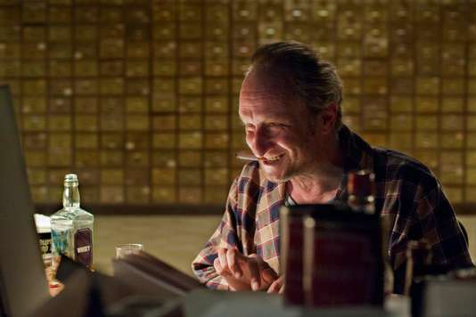
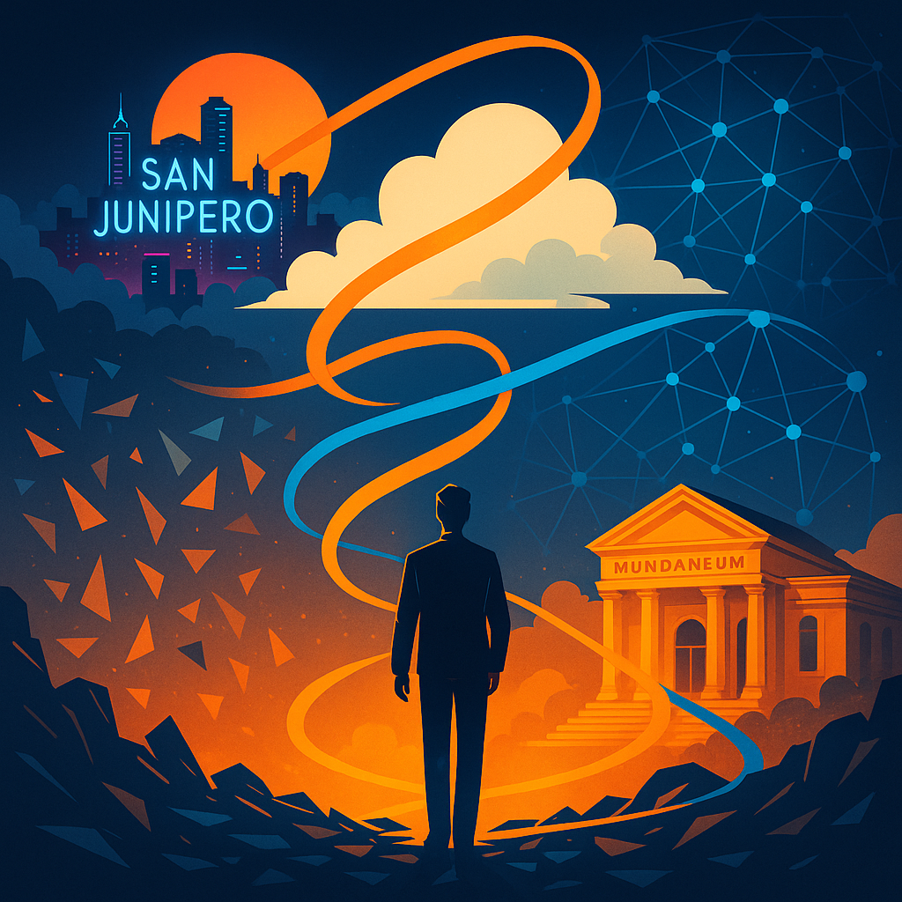
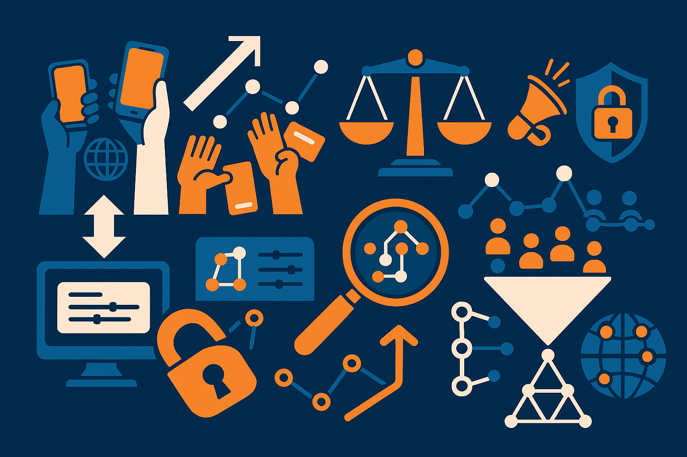
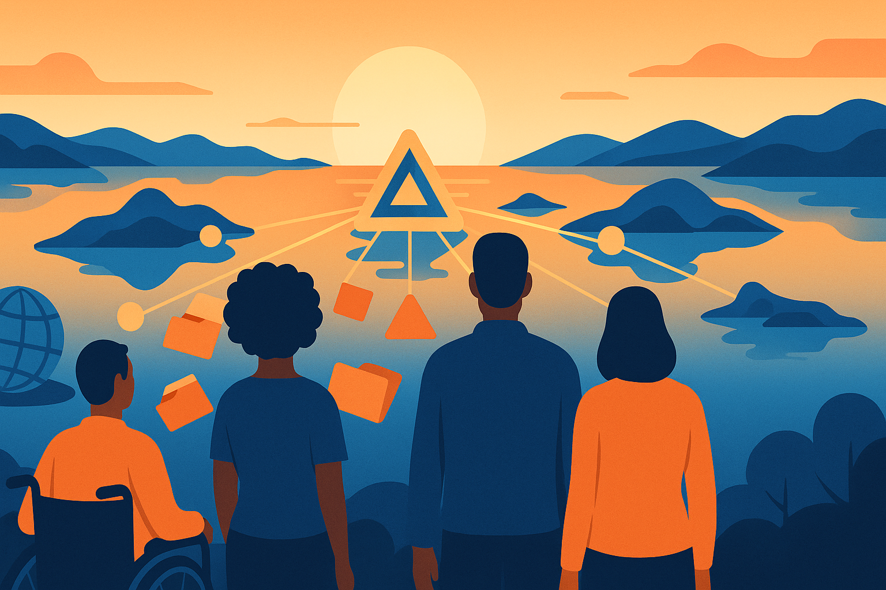

# De la pertinence à l'influence, de l'information à l'attention : l'organisation des connaissances déjà hors classement&nbsp;?
**Olivier Le Deuff**  
Université Bordeaux Montaigne — Laboratoire MICA  
Institut Universitaire de France  
<oledeuff@gmail.com>  
ISKO 2025 · Metz, 13–14 octobre 2025

---
**Introduction**  
## L'organisation plutôt que la connaissance ?
> Il grimpe comme un singe sur une échelle, fonce sur un volume évidemment visé d'en bas, tombe juste dessus, me le descend et dit : « J'ai là pour vous, mon général, une bibliographie des bibliographies […]. » […] « Mon général ! Vous voulez savoir comment je puis connaître chacun de ces livres ? Rien ne m'empêche de vous le dire : c'est parce que je n'en lis aucun ! » […] « Celui qui met le nez dans le contenu est perdu pour la bibliothèque ! […] Jamais il ne pourra avoir une vue d'ensemble ! »  Musil, 2011, p. 581

---

**Introduction**  
## Celui qui classe reste inclassable
>*il ne fut rien sinon mundanéen* (Paul Otlet)

---
**Introduction**  
## Les limites des classifications
- les biais de construction
- les visions occidento-centrées
- le reflet d'une époque

---

# Partie 1 : le déclassement

--- 

# Un déclassement face aux algos
> […] avec la récursivité, l'échelle et l'ubiquité croissantes des infrastructures sociotechniques, les algorithmes et les index sont devenus à la fois plus opaques et plus mobiles, dissimulant les hypothèses logiques et psychologiques autrefois très claires dans les classifications et structures taxonomiques traditionnelles.  
Day, p. 16

---

# De la recherche d’information à la recherche d’attention

- Passage lié au **Web 2.0 / Web social**  
- Diffusion massive de documents personnels  
- L’objectif change :  
  - **Pertinence → Influence**  
  - **autorité** → **Popularité** quantifiable (likes, vues, partages)  
  - Triomphe du **calcul du ratio** sur la **raison**  

---

# Pertinence vs Influence

- Web social → mise en avant de l’influence  
- Nouveau **prisme documentaire** difficile à accepter  
- Le web n’est pas qu’un espace de recherche d’info, mais de **visibilité**  
- Ce qui *compte* se mesure (followers, RT, likes, etc.)... et possède une valeur monétaire.

---
# Une illusion de liberté

- Interfaces semblent démocratiser et personnaliser  
- Mais : logiques de gouvernementalité présentes  
- Nouveaux acteurs du Web = nouveaux pouvoirs  
- Croissance des phénomènes :  
  - Autodocumentation (Gorichanaz)
  - Hyperdocumentation  (Otlet)

---
# Partie 2 : un web toujours documentaire

---
# Du projet initial à l'individu-document

- Projet initial : *data, news, documentation*  
- Partage scientifique et technique  
- Évolution → espace populaire et marchand  
- Mais la question documentaire n’a pas disparu  

---
# Évolution des pratiques documentaires

- Complexité et diversité accrues  
- Un public élargi, bien au-delà des lettrés ou des premiers usages
- Longtemps centrés sur :  
  - le **besoin d’information**  
  - les **outils** pour la retrouver  

---
# Autodocumentation

- Réseaux sociaux : Facebook, Twitter/X, Instagram, YouTube…  
- Formes : photos, vidéos, messages, tags, likes  
- Preuve d’un **nouveau régime documentaire**  
  - *Indexation des existences*  
  - L'organisation des connaissances devient secondaire  
    - L'opinion personnelle croît dans un contexte d'autopromotion  

---
## Hyperdocumentation
>Au sixième stade, un stade de plus et tous les sens ayant donné lieu à un
développement propre, une instrumentation enregistreuse ayant été établie pour
chacun, de nouveaux sens étant sortie de l’homogénéité primitive et s’étant
spécifiés, tandis que l’esprit perfectionne sa conception, s’entrevoit dans ces
conditions l’Hyper-Intelligence. « Sens-Perception-Document » sont choses, notions
soudées. Les documents visuels et les documents sonores se complètent d’autres
documents, les tactiles, les gustatifs, les odorants et d’autres encore. À ce stade
aussi l’ « insensible », l’imperceptible, deviendront sensible et perceptible par
l’intermédiaire concret de l’instrument-document. L’irrationnel à son tour, tout ce qui est intransmissible et fut négligé, et qui à cause de cela se révolte et se soulève comme il advient en ces jours, l’irrationnel trouvera son « expression » par des voies encore insoupçonnées. Et ce sera vraiment alors le stade de l’Hyper-
Documentation. (Otlet, 1934).

# Hyperconnexion & Hyperdocumentation

- Connexion permanente aux dispositifs  
- Captation généralisée de tout ce qui est perceptible par nos sens. 
- Logiques d’**éditorialisation** :  
  - Exister = avoir un profil visible  
  - Produire des contenus = produire la réalité... ou des **alternatives crédibles**  
  - L’éditorialisation = **négociation du réel** (Vitali-Rosati, 2016)  

---

# Partie 3 Les Mundaneum de la dystopie

---

## Vers l’hyperdocumentation totale

>« L’homme n’aurait plus besoin de documentation s’il était assimilé à un être
devenu omniscient, à la manière de Dieu même. À un degré moins ultime serait créée une instrumentation agissant à distance qui combinerait à la fois la radio, les rayons Röntgen, le cinéma et la photographie microscopique. Toutes les choses de l’univers, et toutes celles de l’homme seraient enregistrées à distance à mesure qu’elles se produiraient. Ainsi serait établie l’image mouvante du monde, sa mémoire, son véritable double. Chacun à distance pourrait lire le passage lequel, agrandi et limité au sujet désiré, viendrait se projeter sur l’écran individuel. Ainsi, chacun dans son fauteuil pourrait contempler la création, en son entier ou en certaines de ses parties. »
(Otlet, Monde, essai d'universalisme, 1935)

---
# Une surveillance généralisée ?
- et si finalement, il s'agissait surtout de documenter toutes les activités humaines... pour permettre à cerains "depuis leur fauteuil" de contempler et de contrôler

---
# Faut-il aller à San Junipero ?

---

# Le risque d'un hyperséparatisme
> Du train dont marche le monde, en voie d’hyperséparatisme, il n’y aura bientôt plus que la documentation pour établir un contact régulier et bienveillant entre les hommes.  
Otlet, 1935

---
## Partie 4 : Résister, déplier, déployer

---

## Nouvelles pistes ?
-  Une documentation **Bottom-up**  plutôt que **top down**
- La documentation comme résistance ?  
- **Accountability**  
- **Contre-pouvoir**   

---

# Hyperdocumentation, responsabilité (accountability) et sousveillance
- violences policières  (BLM protests)
- crimes de guerre (Ukraine, Gaza)
- Investigations sur les algos, luttes contre les biais et manipulations. 
  - *Hyperinvestigations*

---
# Repenser les milieux de savoir
- Des **espaces communs** plutôt que des espaces uniques  
- **LLM**:  qui choisit et organise les corpus : **quel alignement ?**

---
# Repenser les machines et leur gouvernementalité
- Avant leur concrétisation technique
- Des classifications aux cerveaux mécaniques
- Repenser les **machines désirantes**..
- en les pensant aussi **délirantes, dérivantes et délivrantes**.

---
# Conclusion : Devenons enfin **nexialistes**
